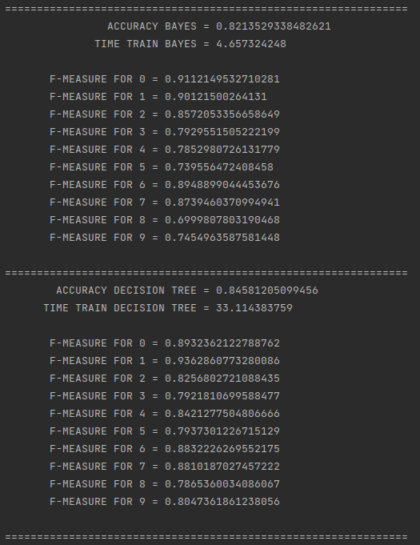

# DD-DM

## MLlib sur Spark

Pour éxécuter le programme lancez ```src/main/scala/TestSparkMLLib.scala```

Cela utilise Naive Bayes puis Decision Tree sur un ensemble d'images de chiffres ( entre 0 et 9 ) écrits de manière manuscrite issus de la base de donnée mnist. Le programme affiche dans la console les résultats d'accuracy et de f-mesure pour les deux algorithme sur un ensemble de test généré aléatoirement.

Voici un exemple de l'éxécution du programme : 




Le rapport se trouve dans fichier suivant --TODO--.